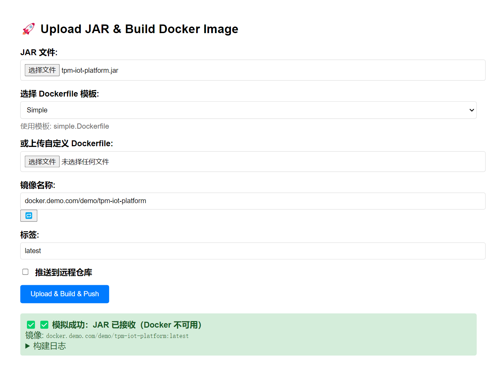

# App2Docker

🚀 **一键将应用打包成 Docker 镜像的可视化平台**

支持 Java、Node.js、Python、Go、静态网站等多种应用类型，提供 Web 界面操作，无需编写 Dockerfile。



---

## ⚡ 快速开始

### 使用 Docker 镜像（推荐）

```bash
docker run -d \
  --name app2docker \
  -p 8000:8000 \
  -v $(pwd)/data:/app/data \
  -v /var/run/docker.sock:/var/run/docker.sock \
  registry.cn-shanghai.aliyuncs.com/51jbm/app2docker:latest
```

访问：**http://localhost:8000**  
默认账号：`admin` / `admin`

---

## 📦 核心功能

### 1. 构建镜像

**从文件构建**：

- 支持 Java（.jar）、Node.js、Python、Go、静态网站
- 选择项目类型和模板
- 上传应用文件，填写镜像名称和标签
- 实时查看构建日志

**从 Git 源构建**：

- 配置 Git 仓库地址和分支
- 支持自动构建和推送镜像

### 2. 流水线管理（CI/CD）

- **Webhook 触发**：支持 GitHub、GitLab、Gitee
- **分支策略**：
  - 使用推送分支构建（所有分支都触发）
  - 只允许匹配分支触发（使用推送分支构建）
  - 使用配置分支构建（所有分支都触发）
- **分支标签映射**：不同分支自动使用不同标签（如 master→latest, dev→dev）
- **定时触发**：支持 Cron 表达式定时构建
- **构建历史**：查看历史构建记录和日志

### 3. 导出镜像

- 单个镜像导出
- Docker Compose 批量导出
- 支持 Gzip 压缩

### 4. 任务管理

- 查看所有构建和导出任务
- 实时查看任务日志
- 任务状态跟踪（等待中/进行中/已完成/失败）
- 任务清理功能

### 5. 配置管理

- **Docker 仓库配置**：支持多个仓库，可设置激活仓库
- **仓库认证测试**：测试仓库登录是否正常
- **自动推送**：构建完成后自动推送到激活仓库

---

## 🎯 使用流程

### 快速构建

1. 登录系统
2. 选择**构建镜像**标签
3. 选择项目类型和模板
4. 上传文件或配置 Git 源
5. 填写镜像名称和标签
6. 点击**开始构建**

### 配置流水线

1. 进入**流水线管理**
2. 点击**新建流水线**
3. 配置基本信息（名称、Git 地址、分支）
4. 配置构建参数（项目类型、镜像名称、标签）
5. 配置 Webhook 设置：
   - 选择分支策略
   - 配置分支标签映射（可选）
6. 保存后获取 Webhook URL
7. 在 Git 平台配置 Webhook

---

## ⚙️ 配置说明

### Docker 仓库配置

点击右上角 **⚙️ 配置** → **Docker 配置**：

- **Registry 地址**：docker.io 或私有仓库地址
- **镜像前缀**：自动添加到镜像名前
- **账号/密码**：仓库认证信息
- **测试登录**：验证仓库认证是否正常

### 自定义端口

```bash
docker run -d \
  -e APP_PORT=9000 \
  -p 9000:9000 \
  -v $(pwd)/data:/app/data \
  -v /var/run/docker.sock:/var/run/docker.sock \
  registry.cn-shanghai.aliyuncs.com/51jbm/jar2docker:latest
```

---

## 🔒 安全建议

1. **首次使用必须修改管理员密码**
2. **配置 Docker 仓库认证信息**
3. **生产环境建议**：
   - 使用 HTTPS（前置 Nginx 反向代理）
   - 限制访问 IP
   - 定期备份 `data/` 目录

---

## 📂 数据持久化

**重要**：必须映射 `data/` 目录，否则配置和模板会丢失！

```bash
-v $(pwd)/data:/app/data
```

**目录内容**：

- `config.yml` - 配置文件
- `templates/` - 用户自定义模板
- `uploads/` - 上传的文件（临时）
- `exports/` - 导出的镜像

---

## ❓ 常见问题

### Q: 构建失败怎么办？

查看构建日志，常见原因：

- Docker 服务未运行
- 文件格式不正确
- 模板配置有误

### Q: 如何推送到私有仓库？

1. 在 Docker 配置中添加仓库信息
2. 设置该仓库为激活仓库
3. 镜像名使用完整路径（如 `registry.example.com/myapp`）
4. 勾选"构建完成后推送镜像"

### Q: Webhook 不触发怎么办？

1. 检查 Webhook URL 是否正确
2. 检查分支策略配置
3. 查看后端日志确认是否收到请求
4. 检查流水线是否已启用

---

## 📄 开源协议

MIT License - 详见 [LICENSE](LICENSE)

---

**开始使用吧！** 🐳
