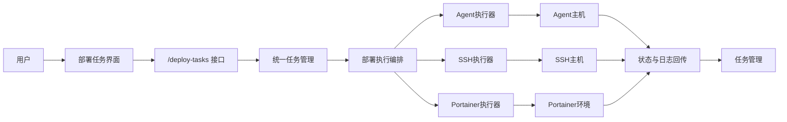

# App2Docker

🚀 **一键将应用打包成 Docker 镜像的可视化平台**

支持 Java（JAR）、Node.js、Python、Go、静态网站等多种应用类型，提供 Web 界面操作，无需编写 Dockerfile。


---

## ⚡ 快速开始

### 使用 Docker 镜像（推荐）

```bash
docker run -d \
  --name app2docker \
  -p 8000:8000 \
  -v $(pwd)/data:/app/data \
  -v /var/run/docker.sock:/var/run/docker.sock \
  registry.cn-shanghai.aliyuncs.com/51jbm/app2docker:latest
```

访问：**http://localhost:8000**  
默认账号：`admin` / `admin`

---

## 📦 核心功能

### 1. 镜像构建

**分步构建流程**：

- 支持 Java（JAR）、Node.js、Python、Go、静态网站
- 选择数据源（文件上传或 Git 数据源）
- 确认分支（Git 源）
- 选择项目类型和模板
- 选择服务（多服务构建）
- 选择资源包（可选）
- 填写镜像名称和标签
- 实时查看构建日志

### 2. 流水线管理（CI/CD）

- **Webhook 触发**：支持 GitHub、GitLab、Gitee
- **分支策略**：
  - 使用推送分支构建（所有分支都触发）
  - 只允许匹配分支触发（使用推送分支构建）
  - 使用配置分支构建（所有分支都触发）
- **分支标签映射**：不同分支自动使用不同标签（如 master→latest, dev→dev）
- **定时触发**：支持 Cron 表达式定时构建
- **构建历史**：查看历史构建记录和日志

### 3. 导出镜像

- 单个镜像导出
- Docker Compose 批量导出
- 支持 Gzip 压缩

### 4. 任务管理

- 查看所有构建和导出任务
- 实时查看任务日志
- 任务状态跟踪（等待中/进行中/已完成/失败）
- 任务清理功能

### 5. 配置管理

- **Docker 仓库配置**：支持多个仓库，可设置激活仓库
- **仓库认证测试**：测试仓库登录是否正常
- **自动推送**：构建完成后自动推送到激活仓库

### 6. 部署任务

- **统一任务管理**：部署任务与构建/导出任务统一在任务管理中查看
- **多执行通道**：支持 Agent、SSH、Portainer 三种目标连接方式
- **两种部署模式**：支持 `docker_run` 与 `docker_compose`
- **能力检测**：根据目标主机能力限制 Compose 模式（`docker-compose` / `docker-stack`）
- **全程可追踪**：实时查看部署日志、状态流转，支持失败后重试


---

## 🎯 使用流程

### 快速构建

1. 登录系统
2. 选择**镜像构建**标签
3. 按照步骤提示操作：
   - 选择数据源（文件上传或 Git 数据源）
   - 确认分支（Git 源）
   - 选择项目类型和模板
   - 选择服务（多服务构建）
   - 选择资源包（可选）
   - 填写镜像名称和标签
4. 点击**开始构建**

### 配置流水线

1. 进入**流水线管理**
2. 点击**新建流水线**
3. 配置基本信息（名称、Git 地址、分支）
4. 配置构建参数（项目类型、镜像名称、标签）
5. 配置 Webhook 设置：
   - 选择分支策略
   - 配置分支标签映射（可选）
6. 保存后获取 Webhook URL
7. 在 Git 平台配置 Webhook

---

## 🚀 部署任务使用指南

### 1. 平台与 Agent/SSH/Portainer 的关系

- 平台负责：创建部署任务、编排执行、记录状态和日志
- 目标连接负责：在目标主机真正执行 Docker 部署命令
- 你可以按场景选择连接方式：
  - **Agent**：适合长期在线主机，状态回传及时，运维体验更好
  - **SSH**：无需额外安装 Agent，适合快速接入已有 Linux 主机
  - **Portainer**：适合已经用 Portainer 管理环境的团队

### 2. 建立连接（先连通，再部署）

1. 进入部署管理或主机管理，新增目标主机
2. 选择连接类型并填写信息：
   - **Agent**：主机接入后等待在线状态
   - **SSH**：填写地址、端口、账号和认证信息
   - **Portainer**：填写地址、访问令牌和目标环境
3. 点击**测试连接**，确认目标可访问 Docker
4. 连接成功后，检查主机能力信息（例如 Compose 模式支持情况）

> 建议：生产环境优先使用稳定的长期连接方式，并为目标主机配置最小权限账号。

### 3. 部署项目（一步步）

1. 准备镜像
   - 使用平台构建产物，或填写已有镜像地址与标签
2. 新建部署配置
   - 选择部署模式：`docker_run` 或 `docker_compose`
   - 填写容器参数、端口、环境变量、卷挂载等信息
3. 选择目标主机并执行
   - 系统会根据主机能力限制可选 Compose 模式
4. 在任务管理查看过程
   - 关注状态：等待中 / 进行中 / 已完成 / 失败
   - 实时查看日志并定位错误
5. 失败后处理
   - 修正配置后重试任务，或切换目标主机再次执行

### 4. 部署任务执行链路（架构图）


```mermaid
flowchart LR
  User[用户] --> DeployUI[部署任务界面]
  DeployUI --> DeployApi["/deploy-tasks 接口"]
  DeployApi --> TaskMgr[统一任务管理]
  TaskMgr --> DeployEngine[部署执行编排]

  DeployEngine --> AgentExec[Agent执行器]
  DeployEngine --> SshExec[SSH执行器]
  DeployEngine --> PortainerExec[Portainer执行器]

  AgentExec --> AgentHost[Agent主机]
  SshExec --> SshHost[SSH主机]
  PortainerExec --> PortainerHost[Portainer环境]

  AgentHost --> TaskState[状态与日志回传]
  SshHost --> TaskState
  PortainerHost --> TaskState
  TaskState --> TaskPanel[任务管理]
```

### 5. 常见排错方向

- **连接失败**：检查主机网络连通性、凭据、端口与防火墙
- **无 Docker 权限**：确认执行账号具备 Docker 操作权限
- **镜像拉取失败**：检查仓库地址、认证配置与镜像标签
- **Compose 模式不可选**：查看主机能力检测结果，确认是否支持对应模式

---

## ⚙️ 配置说明

### Docker 仓库配置

点击右上角 **⚙️ 配置** → **Docker 配置**：

- **Registry 地址**：docker.io 或私有仓库地址
- **镜像前缀**：自动添加到镜像名前
- **账号/密码**：仓库认证信息
- **测试登录**：验证仓库认证是否正常

---

## 🔒 安全建议

1. **首次使用必须修改管理员密码**
2. **配置 Docker 仓库认证信息**
3. **生产环境建议**：
   - 使用 HTTPS（前置 Nginx 反向代理）
   - 限制访问 IP
   - 定期备份 `data/` 目录

---

## 📂 数据持久化

**重要**：必须映射 `data/` 目录，否则配置和模板会丢失！

```bash
-v $(pwd)/data:/app/data
```

**目录内容**：

- `config.yml` - 配置文件
- `templates/` - 用户自定义模板
- `uploads/` - 上传的文件（临时）
- `exports/` - 导出的镜像

---

## ❓ 常见问题

### Q: 构建失败怎么办？

查看构建日志，常见原因：

- Docker 服务未运行
- 文件格式不正确
- 模板配置有误

### Q: 如何推送到私有仓库？

1. 在 Docker 配置中添加仓库信息
2. 设置该仓库为激活仓库
3. 镜像名使用完整路径（如 `registry.example.com/myapp`）
4. 勾选"构建完成后推送镜像"

### Q: Webhook 不触发怎么办？

1. 检查 Webhook URL 是否正确
2. 检查分支策略配置
3. 查看后端日志确认是否收到请求
4. 检查流水线是否已启用

---

## 📄 开源协议

MIT License - 详见 [LICENSE](LICENSE)

---

**开始使用吧！** 🐳
