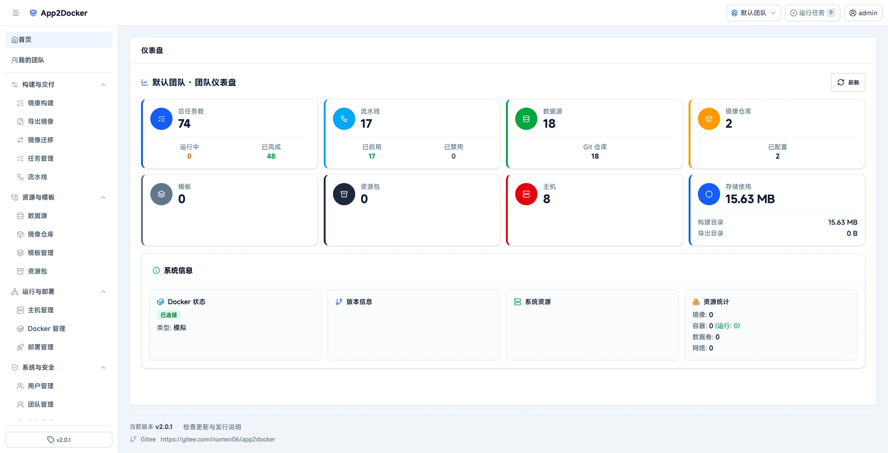
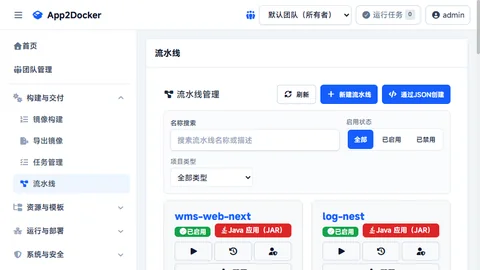
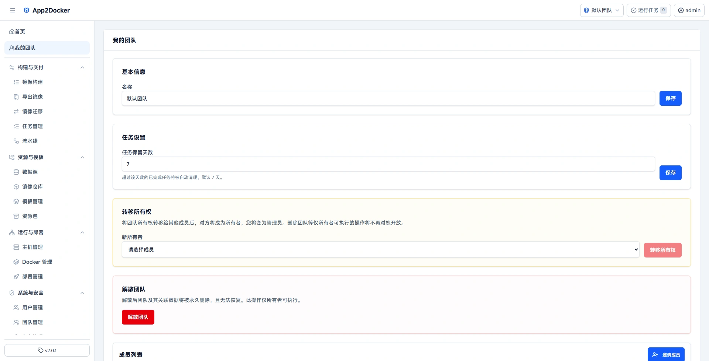
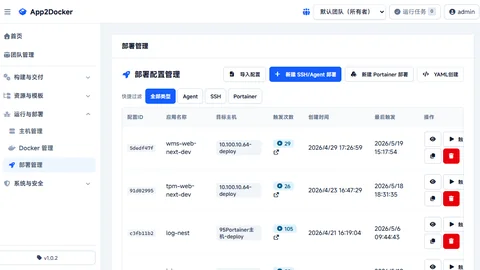
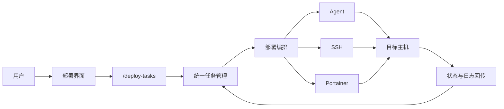

# App2Docker

**团队级 Docker 镜像构建与交付平台** — 从代码到镜像、从构建到部署，在同一工作台完成。

支持 Java（JAR）、Node.js、Python、Go、静态网站等多种应用类型；提供 Web 可视化操作，模板复用，无需从零手写 Dockerfile。

## 界面预览

| 仪表盘 | 流水线与构建 |
|:---:|:---:|
|  |  |

| 团队协作 | 部署联动 |
|:---:|:---:|
|  |  |

## 快速开始

### Docker 一键运行（推荐）

```bash
docker run -d \
  --name app2docker \
  -p 8000:8000 \
  -v $(pwd)/data:/app/data \
  -v /var/run/docker.sock:/var/run/docker.sock \
  registry.cn-shanghai.aliyuncs.com/51jbm/app2docker:latest
```

- 访问：**http://localhost:8000**
- 默认账号：`admin` / `admin`（首次登录后请立即修改密码）

### 数据目录

务必挂载 `data/`，否则配置、模板与导出文件会丢失：

```bash
-v $(pwd)/data:/app/data
```

目录包含：`config.yml`、`templates/`、`uploads/`、`exports/` 等。

## 核心能力

### 镜像构建

分步向导完成一次构建：

1. 选择数据源（文件上传或 Git 数据源）
2. 确认分支（Git 源）
3. 选择项目类型与 Dockerfile 模板
4. 选择服务（支持 Java 等多服务构建）
5. 可选挂载资源包
6. 填写镜像名称与标签，实时查看构建日志

### 流水线（CI/CD）

- Webhook 触发：GitHub、GitLab、Gitee
- 分支策略与分支→标签映射（如 `main` → `latest`）
- Cron 定时构建
- 构建历史与日志追溯

详细配置见 [流水线使用指南](docs/pipeline-guide.md)。

### 镜像导出与仓库

- 单镜像 / Docker Compose 批量导出，支持 Gzip
- 多仓库配置、登录测试、构建后自动推送

### 部署与主机

- 统一任务管理：构建、导出、部署任务同一入口
- 目标连接：Agent、SSH、Portainer
- 部署模式：`docker_run`、`docker_compose`（按主机能力自动限制 Compose 模式）
- 实时日志、状态流转、失败重试

### 团队与权限

- 团队、成员邀请、角色与菜单级权限
- 模板、流水线、数据源等资源团队内共享

## 典型使用流程

### 快速构建镜像

1. 登录 → 进入 **镜像构建**
2. 按向导选择数据源、类型、模板与服务
3. 填写镜像名与标签 → **开始构建**
4. 在 **任务管理** 查看日志与结果

### 配置流水线

1. 进入 **流水线** → **新建流水线**（名称、Git 源、单/多服务）
2. 在配置页完善 Dockerfile、镜像、Webhook、资源包等
3. 复制 Webhook URL，在 Git 平台配置 Push 事件
4. 推送代码后自动触发，在任务管理中查看构建

### 部署到目标主机

1. **主机管理** 中新增连接（Agent / SSH / Portainer），**测试连接**
2. **部署管理** 中新建部署配置（镜像、`docker_run` 或 `docker_compose`）
3. 选择目标主机执行，在任务管理跟踪状态与日志

#### Agent 部署示例

在平台生成 `AGENT_SECRET_KEY` 后，于目标主机执行：

```bash
docker run -d \
  --name app2docker-agent \
  --restart=always \
  -e AGENT_SECRET_KEY=<你的密钥> \
  -e SERVER_URL=ws://<平台IP或域名>:8000 \
  -v /var/run/docker.sock:/var/run/docker.sock \
  -v /proc:/host/proc:ro \
  -v /sys:/host/sys:ro \
  registry.cn-shanghai.aliyuncs.com/51jbm/app2docker-agent:latest
```

说明：

- `SERVER_URL` 须为目标主机可访问的地址，容器内勿用 `localhost`
- 平台启用 HTTPS 时改为 `wss://<域名>`

### 部署执行链路


```mermaid
flowchart LR
  User[用户] --> DeployUI[部署界面]
  DeployUI --> DeployApi["/deploy-tasks"]
  DeployApi --> TaskMgr[统一任务管理]
  TaskMgr --> Engine[部署编排]

  Engine --> Agent[Agent]
  Engine --> SSH[SSH]
  Engine --> Portainer[Portainer]

  Agent --> Host[目标主机]
  SSH --> Host
  Portainer --> Host
  Host --> Logs[状态与日志回传]
  Logs --> TaskMgr
```

## 配置说明

右上角 **设置** → **Docker 配置**：

| 项 | 说明 |
| --- | --- |
| Registry 地址 | `docker.io` 或私有仓库 |
| 镜像前缀 | 自动拼接到镜像名 |
| 账号 / 密码 | 仓库认证 |
| 测试登录 | 验证凭据是否有效 |

## 安全建议

1. 首次使用必须修改管理员密码
2. 为 Docker 仓库配置认证，避免匿名推送/拉取失败
3. 生产环境建议：HTTPS（Nginx 反代）、限制访问 IP、定期备份 `data/`

## 常见问题

**构建失败**  
查看任务日志。常见原因：本机 Docker 未运行、上传格式不符、模板参数错误。

**推送到私有仓库**  
添加并激活目标仓库 → 镜像名使用完整路径（如 `registry.example.com/myapp`）→ 构建时勾选推送。

**Webhook 未触发**  
核对 URL、分支策略、流水线是否启用；查看服务端是否收到请求。

**部署连接失败**  
检查网络、凭据、防火墙；确认执行账号有 Docker 权限；Compose 不可选时查看主机能力检测结果。

**镜像拉取失败**  
检查仓库地址、认证与标签是否存在。

## 相关文档

- [流水线功能使用指南](docs/pipeline-guide.md)
- [Portainer API 说明](docs/portainer-api.md)

## 开源协议

MIT License — 详见 [LICENSE](LICENSE)
