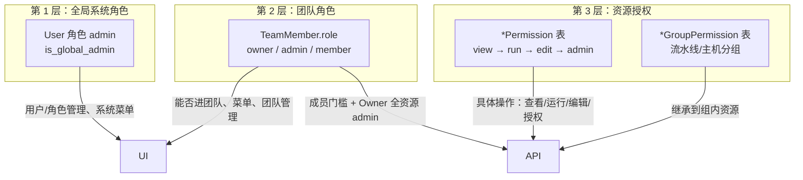
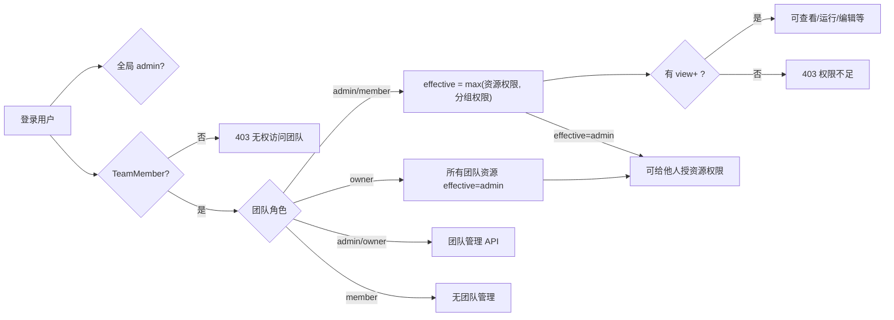

# 团队角色与资源授权说明

本文档描述系统中 **团队管理员 / 团队成员** 与 **资源级授权** 的关系，对应实现见：

- `backend/team_permissions.py` — 团队角色与菜单
- `backend/resource_permissions.py` — 资源有效权限
- `backend/team_scope.py` — 团队租户范围
- `backend/routes/teams.py` — 团队管理 API
- `backend/routes/resource_permissions.py` — 资源成员权限 API

---

## 一、三层权限模型



| 层级 | 存储位置 | 作用 |
|------|----------|------|
| 全局 | 用户 `role`（`check_role(username, "admin")`） | 跨团队的用户/角色管理；前端「系统与安全」菜单 |
| 团队 | `team_members.role` | 能否访问该 `team_id`、侧栏菜单、邀请/改角色/删团队等 |
| 资源 | `pipeline_permissions` 等 + 分组权限表 | 对单条流水线/主机/数据源等的 view/run/edit/admin |

业务 API 默认都要带 `team_id`，且必须是该团队成员（`resolve_team_scope` / `require_team_member`）。**全局 admin 在业务接口上同样受 team 约束**（见 `team_scope.py` 注释）。

---

## 二、团队角色：owner / admin / member

`TeamMember.role` 合法值为：`owner`、`admin`、`member`（`backend/routes/teams.py` 中 `TEAM_ROLES`）。

### 2.1 角色能力对照

| 能力 | owner | admin（团队管理员） | member（普通成员） |
|------|:-----:|:------------------:|:------------------:|
| 进入团队、查看成员列表 | ✓ | ✓ | ✓ |
| 修改团队信息、团队设置 | ✓ | ✓ | ✗ |
| 邀请成员（默认 member） | ✓ | ✓ | ✗ |
| 邀请 **admin** 角色 | ✓ | ✗ | ✗ |
| 任命/降级 **admin** | ✓ | ✗ | ✗ |
| 移除 **admin** | ✓ | ✗ | ✗ |
| 转让 **owner** | ✓ | ✗ | ✗ |
| 解散团队（DELETE team） | ✓ | ✗ | ✗ |
| 前端 `can_manage_team` | ✓ | ✓ | ✗ |
| 前端 `can_assign_admin` | ✓ | ✗ | ✗ |
| 前端 `can_dissolve_team` | ✓ | ✗ | ✗ |

团队管理 API 使用 `require_team_admin` / `require_team_owner`（`backend/team_permissions.py`）。

### 2.2 菜单权限（UI 侧栏）

由 `GET /api/teams/{team_id}/menu-permissions` 下发，逻辑在 `menu_permissions_for_team_role`：

| 角色 | 可见菜单（`permissions` 字段） |
|------|--------------------------------|
| **member** | `menu.dashboard`、`menu.pipeline`、`menu.host` |
| **owner / admin** | `ALL_MENU_PERMISSIONS`（构建、导出、任务、数据源、仓库、模板、资源包、部署等） |

**注意：用户/角色管理**

- 后端给 owner/admin 的列表里包含 `menu.users`，但前端「系统与安全」分组要求 **全局 `is_global_admin`**，且全局权限含 `menu.users`（`AdminLayout.vue`）。
- **团队管理员 ≠ 系统用户管理员**；团队 admin 多的是业务菜单，不是全站用户管理。

---

## 三、资源授权：与团队角色的关系

资源权限与团队角色 **基本解耦**，核心在 `backend/resource_permissions.py`。

### 3.1 权限级别

```
view < run < edit < admin
```

支持资源类型：

| 类型 | 资源级权限表 | 分组权限表 |
|------|-------------|-----------|
| pipeline | `PipelinePermission` | `PipelineGroupPermission` |
| host / agent_host | `HostPermission` | `HostGroupPermission` |
| deploy_config | `DeployConfigPermission` | — |
| git_source | `GitSourcePermission` | — |
| resource_package | `ResourcePackagePermission` | — |
| registry | `RegistryPermission` | — |
| template | `TemplatePermission` | — |

### 3.2 有效权限计算（`get_effective_permission`）

对带 `team_id` 的资源：

1. **团队 owner** → 直接视为该资源 **`admin`**（无需 `*Permission` 表记录）。
2. **团队 admin / member** → **不**因团队角色自动获得资源权限；只看：
   - 资源级：`*Permission` 表中该用户的记录；
   - 分组级：资源 `group_id` 上的 `*GroupPermission`；
   - 取两者较高者（`max_permission`）。
3. 无 `team_id` 的历史资源 → 视为 **`admin`**（兼容旧数据）。

创建资源时会对创建者调用 `grant_creator_admin`，写入该资源的 **admin**。

### 3.3 「能出现在列表」vs「能操作」

| 判断 | 函数 | 规则 |
|------|------|------|
| 列表是否展示 | `user_can_list_resource` / `user_can_access_resource` | 只要是该 `team_id` 的**任意成员**，列表里就能看到该团队资源 |
| 具体操作 | `require_resource_permission` | 有效权限必须 ≥ 所需级别（view/run/edit/admin） |

因此：**普通成员能在列表里看到团队内资源，但没有授权时调详情/编辑/运行会 403**；列表接口可附带 `my_permission` 供前端禁用按钮（`teamStore.canManageResource`）。

### 3.4 谁可以给资源授权

管理某资源的成员权限（如 `PUT /api/pipelines/{id}/members/{user_id}`）需要：

- 操作者对该资源具备 **`admin`** 资源权限；或
- 是团队 **owner**（隐式 admin）。

目标用户必须是**同一团队成员**（`_ensure_target_team_member`）。

**团队 admin 不会自动拥有所有资源的 admin**；除非他是 owner、创建者、或被显式授予/通过分组继承。

### 3.5 分组权限 API 门槛（与单资源不同）

流水线分组 / 主机分组的成员权限 API 目前只要求 **团队成员**（`require_team_member_for_resource`），**未**要求团队 admin 或该分组的资源 admin。与单资源授权 API 的门槛不一致，修改行为时需注意。

---

## 四、关系总览



---

## 五、典型场景速查

| 场景 | 结果 |
|------|------|
| 新加入的 **member**，未授任何资源权限 | 能看见团队资源列表；打开流水线详情等需要 view → **403** |
| **团队 admin**，未单独授资源权限 | 业务菜单全；资源操作同 member，**不能**默认可编辑所有流水线 |
| **团队 owner** | 团队管理全开 + 团队内所有资源隐式 **admin** |
| 创建流水线的人 | 创建时写入 `PipelinePermission` **admin** |
| 被授予流水线 **run** | 可触发运行；不能改配置（需 edit/admin） |
| 被授予流水线 **admin** | 可管理该流水线的成员权限 |
| **全局 admin** | 可管全站用户/角色；进业务页仍要选团队且要是成员 |

---

## 六、关键代码锚点

### 团队角色校验

```python
# backend/team_permissions.py
def require_team_admin(db, team_id, user_id):
    member = require_team_member(db, team_id, user_id)
    if member.role not in ("owner", "admin"):
        raise HTTPException(status_code=403, detail="需要团队管理员权限")

def menu_permissions_for_team_role(role):
    if role in ("owner", "admin"):
        return TEAM_ADMIN_MENU_PERMISSIONS  # ALL_MENU_PERMISSIONS
    return TEAM_MEMBER_MENU_PERMISSIONS     # dashboard, pipeline, host
```

### 资源有效权限（仅 owner 特权）

```python
# backend/resource_permissions.py
def get_effective_permission(db, user_id, resource_type, resource_id):
    if is_team_owner(db, team_id, user_id):
        return "admin"
    return max_permission(resource_perm, group_perm)
```

### 列表 vs 操作

```python
# backend/resource_permissions.py
def user_can_list_resource(...):
    if get_team_member(db, team_id, user_id):
        return True  # 任意成员可见于列表
    return get_effective_permission(...) is not None
```

### 菜单能力 API 响应

```python
# backend/routes/teams.py — GET /teams/{team_id}/menu-permissions
can_manage_team = role in ("owner", "admin")
can_assign_admin = role == "owner"
can_dissolve_team = role == "owner"
```

---

## 七、设计要点（摘要）

- **团队角色**：解决「能不能进这个团队、能不能管团队、侧栏能看到什么」。
- **资源授权**：解决「在这条资源上能看什么、能跑还是能改、能不能给别人授权」。
- **只有 owner 在资源层有团队级超管**；**admin 是团队运营管理员，不是资源超级管理员**。
- **member** 默认最小菜单 + 必须逐资源（或分组）授权才能操作。

若要调整产品行为（例如让团队 admin 也隐式拥有全团队资源 admin，或让 member 列表也按资源权限过滤），需修改 `get_effective_permission` / `user_can_list_resource` 的策略。

---

## 八、相关 API

| 用途 | 方法 | 路径 |
|------|------|------|
| 我的团队列表 | GET | `/api/teams/me` |
| 团队菜单与能力 | GET | `/api/teams/{team_id}/menu-permissions` |
| 成员列表 | GET | `/api/teams/{team_id}/members` |
| 改成员角色 | PATCH | `/api/teams/{team_id}/members/{user_id}` |
| 邀请 | POST | `/api/teams/{team_id}/invite` |
| 流水线成员权限 | GET/PUT/DELETE | `/api/pipelines/{id}/members[/{user_id}]` |
| 我的流水线权限 | GET | `/api/pipelines/{id}/my-permission` |
| 主机成员权限 | GET/PUT/DELETE | `/api/hosts/{id}/members[/{user_id}]` |
| 流水线分组权限 | GET/PUT/DELETE | `/api/pipeline-groups/{group_id}/members[/{user_id}]` |

本地角色回归脚本：`scripts/setup-team-role-test.ps1`。
